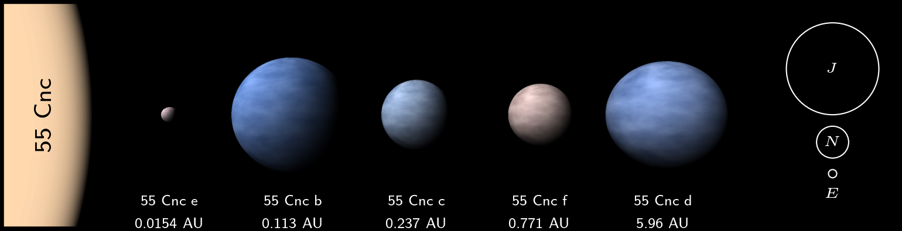

.. Example documentation master file, created by
   sphinx-quickstart on Sat Sep 23 20:35:12 2023.
   You can adapt this file completely to your liking, but it should at least
   contain the root `toctree` directive.

EXOTIC: EXoplanet Observables Translated Into Color
===================================

EXOTIC is a Python package to convert exoplanet properties into human-eye visible color. EXOTIC uses publically available codes Virga and Picaso to generate synthetic exoplanet 
relfection spectra, and then convolves these spectra with the human eye's response function, resulting in RGB colors fit for computer display. EXOTIC also features visualisation tools, 
built in both Python and C++, to display these colors. 

.. toctree::
   :maxdepth: 1
   color_gen
   render
